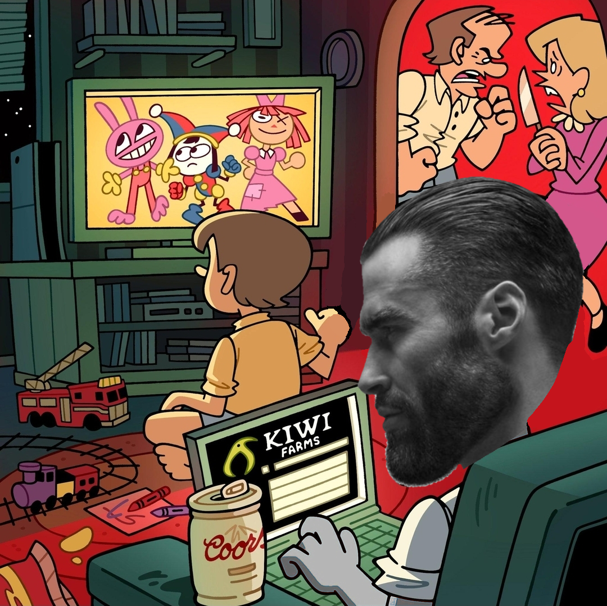

<body class="is_thread board_g">

[ <a href="#" title="Soyjaks">soy</a> | <a href="#" title="Question & Answer">qa</a> | <a href="#" title="Raid: SHADOW LEGENDS">raid</a> | <a href="#" title="Requests & Soy Art">r</a> ] [ <a href="#" title="International">int</a> | <a href="#" title="Politics & countrywars">pol</a> ] 
[<a href="#">Settings</a>] [<a href="#">Search</a>] [<a href="#">Mobile</a>] [<a href="#">Home</a>]

<h1 class="boardTitle">/g/ - Technology</h1>

[<a href="https://github.com/thatfrozenfrog/thatfrozenfrog/pulls">Post a Reply</a>]

<!-- NEWS SEC O ALGO -->

<table id="blotter" class="desktop" align="center" cellpadding="8">
<tbody id="blotter-msgs">
<tr>
    <td class="blotter-date">08/21/20</td>
    <td class="blotter-content">New boards added: <a href="#">/vrpg/</a>, <a href="#">/vmg/</a>, <a href="#">/vst/</a> and <a href="#">/vm/</a></td>
</tr>
<tr>
    <td class="blotter-date">05/04/17</td>
    <td class="blotter-content">New trial board added: <a href="#">/bant/ - International/Random</a></td>
</tr>
<tr>
    <td class="blotter-date">10/04/16</td>
    <td class="blotter-content">New board for 4chan Pass users: <a href="#">/vip/ - Very Important Posts</a></td>
</tr>
</tbody>

<tfoot><tr><td colspan="2">[<a href="#">Hide</a>] [<a href="#">Show All</a>]</td></tr></tfoot>
</table>

<!-- Banner -->

[<a href="https://intculture.party/secret/jschantest/" target="_blank">Free AI gigachad generator</a>]

[<a href="#" accesskey="a">Return</a>] [<a href="#">Catalog</a>] [<a href="#bottom">Bottom</a>]

<!-- OP Post -->
<table width="100%" cellpadding="14">
<tr>
<td width="360" valign="top">
File: <a href="scripts/art.txt" target="_blank">cirno.txt</a> 📥 (4.2 KB, Shift-JIS)  

</td>
<td valign="top">
⊟ ☐ <b>Anonymous</b> 
09/12/26(Sat)09:20:36&nbsp;
<a href="#p109723556" rel="nofollow">No.</a><a href="#">109723556</a> ˅
&nbsp;<a href="#p109723601">&gt;&gt;109723601</a> <a href="#p109723602">&gt;&gt;109723602</a> <a href="#p109723603">&gt;&gt;109723603</a>
  
 

&ldquo;蛙を瞬時にまんべんなく凍らせれば、蛙は死ぬことなく溶ければ元通りになるのよ。これは遊びじゃなくて氷の修行なの。決して氷漬けの蛙が可愛いだとか、鳴き声が五月蠅いからだとか、お手玉にして遊ぶと砕けそうでハラハラするだとか、そんなんじゃないの&rdquo;  
<i>If immediately I freeze the frogs all the way, they won&#039;t die, and when they thaw, it&#039;s like nothing happened. I&#039;m not playing, but training my ice powers...</i>  

<b>Current GET:</b> 

</td>
</tr>   
</table>

<!-- Reply 1: Contribution stats (indented with dl/dd and natural wrapping) -->
<dl>
<dd>

<table cellpadding="14">
<tr>
<td>

⊟ ☐ <b>Anonymous</b> 
09/12/26(Sat)09:20:51&nbsp;
No.109723601 ˅

<blockquote class="postMessage" id="m109723601">
<a href="#p109723556"><b>&gt;&gt;109723556 (OP)</b></a> 
  

 

</blockquote>
</td>
</tr>
</table>

</dd>
</dl>

<!-- Reply 2: Languages & Year map -->
<dl>
<dd>

<table cellpadding="14">
<tr>
<td>

⊟ ☐ <b>Anonymous</b> 
09/12/26(Sat)09:21:13&nbsp;
No.109723602 ˅

<blockquote class="postMessage" id="m109723602">
<a href="#p109723556"><b>&gt;&gt;109723556 (OP)</b></a> 
Media Pending Anporvool and it never ends 
  

 

</blockquote>
</td>
</tr>
</table>

</dd>
</dl>

<!-- Reply 3: Projects & Socials -->
<dl>
<dd>

<table cellpadding="14">
<tr>
<td>

⊟ ☐ <b>Anonymous</b> 
09/12/26(Sat)09:21:41&nbsp;
No.109723603 ˅

<blockquote class="postMessage" id="m109723603">
<a href="#p109723556"><b>&gt;&gt;109723556 (OP)</b></a> 
<b>SNCA list:</b> 
<ul>
<li><b><a href="https://github.com/thatfrozenfrog/KILLDOZER">KILLDOZER</a></b> &mdash; TelehACK client</li>
KWABAG by el way
<li><b><a href="https://github.com/thatfrozenfrog/nimtauri">nimtauri</a></b> &mdash; Nim language bindings for building desktop apps with Tauri.</li>
<li><b><a href="https://github.com/thatfrozenfrog/580VN-X-Decompilation">580VN-X-Decompilation</a></b> &mdash; Calculator firmware reverse engineering &amp; Assembly.</li>
<li><b><a href="https://github.com/thatfrozenfrog/2048-userscript-module">2048-userscript-module</a></b> &mdash; C++ userscript module for 2048.</li>
<li><b><a href="https://github.com/thatfrozenfrog/TeleSOVLS">TeleSOVLS</a></b> &mdash; Legacy version of Killdozer.</li>
</ul>
<b>Socials:</b> 
  

<b>[NAS OF THE DAY]</b>

 

<!--   -->
<!-- <small>妖精は元々悪戯好きな物であり、それにより手痛いお仕置きを受けることも多々ある。今回被害に遭われた妖精もその物の一例であると考えられる。</small> -->

  

</blockquote>
</td>
</tr>
</table>

<!-- Reply 4: Honoryans -->
<dl>
<dd>

<table cellpadding="14">
<tr>
<td>

⊟ ☐ <b>Anônimo</b> 
09/12/26(Sat)09:22:11&nbsp;
No.109999999 ˅

<blockquote class="postMessage" id="m109999999">
<a href="#p109723603"><b>&gt;&gt;109723603 (You)</b></a> 

Honorary mentions:
<ul>
<li><b><a href="https://github.com/chibikofans">chibikofans</a></b> &mdash; lunaria 4rum owner</li>
</li>

<li><b><a href="https://github.com/unegoist">unegoist</a></b> &mdash; Based idiot</li>
 

</blockquote>
</td>
</tr>
</table>

</dd>
</dl>

[<a href="#" accesskey="a">Return</a>] [<a href="#">Catalog</a>] [<a href="#top">Top</a>]

<small class="absBotDisclaimer">All trademarks and copyrights on this page are owned by their respective parties. Images uploaded are the responsibility of the Poster. Comments are owned by the Poster.</small> 
<small id="footer-links"><a href="https://4chan.org/faq" target="_blank">About</a> &bull; <a href="https://4chan.org/feedback" target="_blank">Feedback</a> &bull; <a href="https://4chan.org/legal" target="_blank">Legal</a> &bull; <a href="https://4chan.org/contact" target="_blank">Contact</a></small>

</body>
